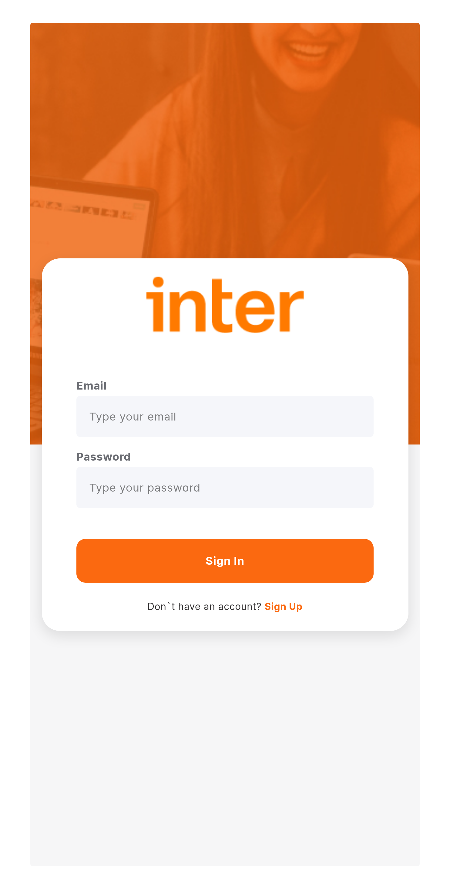
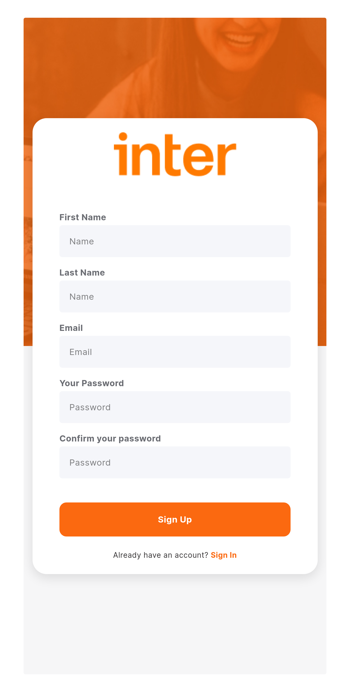
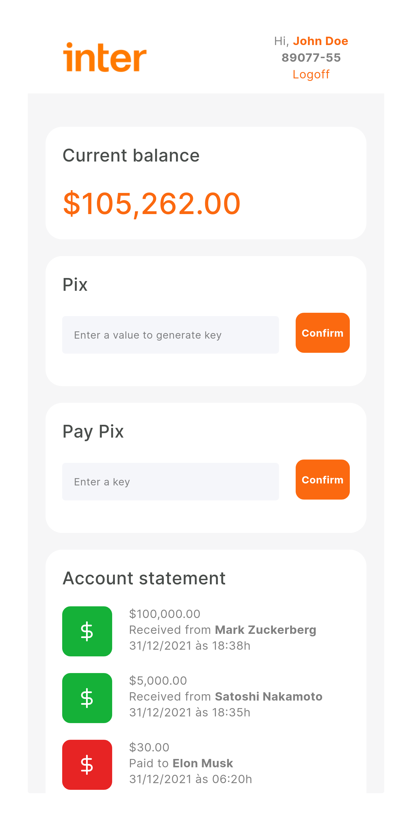

<p align="center">
  
</p>

<p align="center">
   An non-official web-based application for the Inter Bank.
</p>

## Screenshots

<div align="center">
  
  
  
</div>

## Tech Stack

This application bootstraps from [webpack-setup-for-react](https://github.com/fariasmateuss/webpack-setup-for-react/).

## Pre-requisites

Have the following pre-installed:

- [Yarn](https://yarnpkg.com/) — Package manager, similar to npm
- [Node.js](https://nodejs.org/en/)

## Run it

1. Clone the repository:

```git
git clone https://github.com/fariasmateuss/inter-bank-client.git
```

3. Create a copy of the `.env.example` file and rename it to `.env.local`:

```bash
cp .env.example .env.local
```

4. Put your API key in the `.env.local` file.

5. Run the application:

```
yarn dev
```

Open http://localhost:3000 with your browser to see the result.

## API

This application use the backend available at [inter-bank-server](https://github.com/fariasmateuss/inter-bank-server). Follow the README.md file to see how to use the API.

## Contributing

- Fork the repository
- Create a new branch
- Make the changes
- Commit and push

All PR's are welcome!

## License

This project is licensed under the MIT license.
